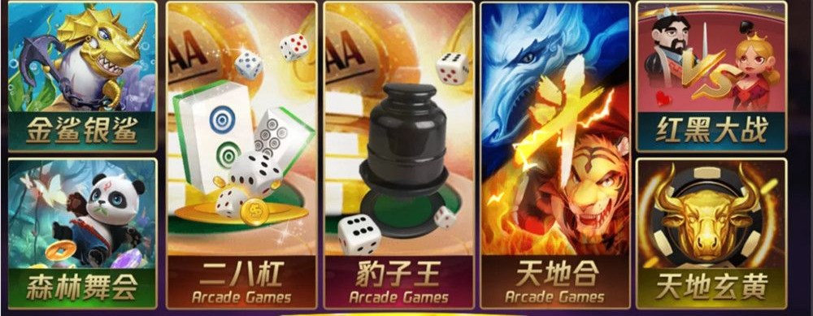
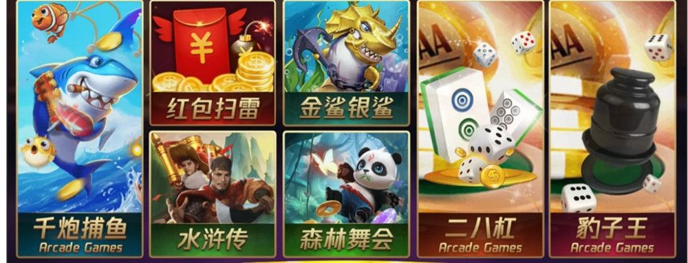
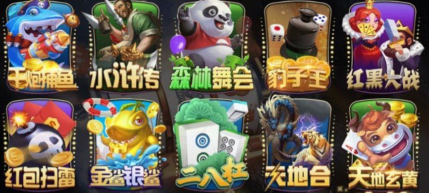
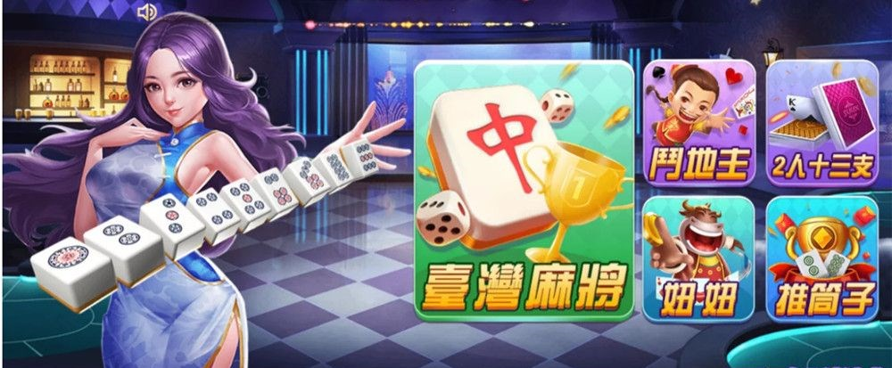
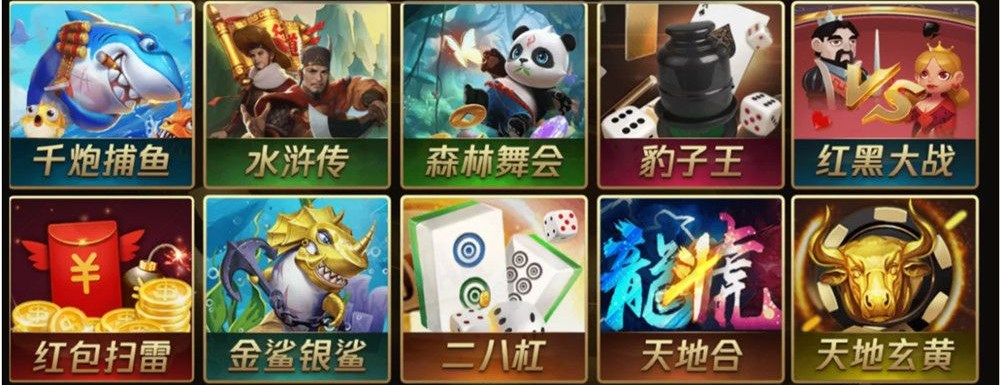
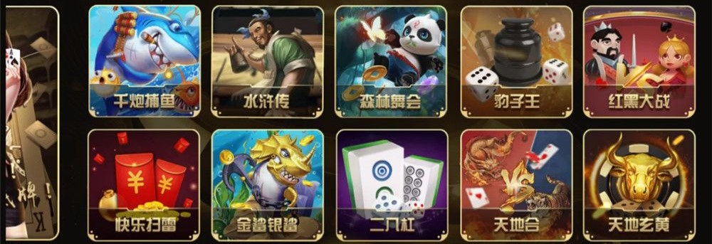
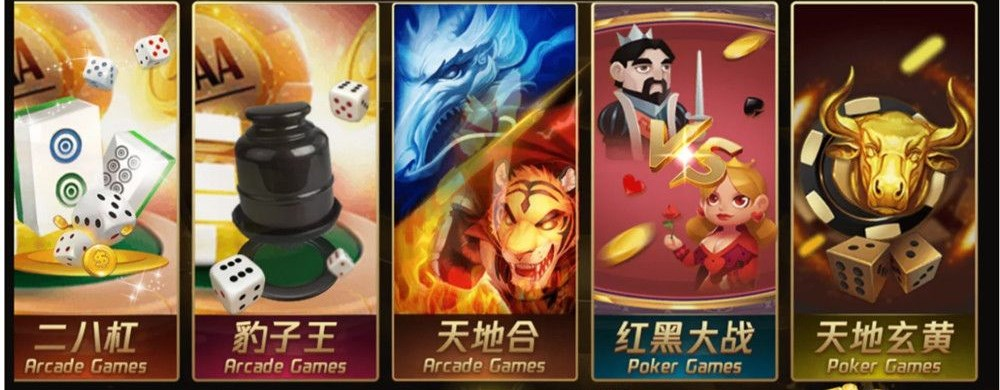
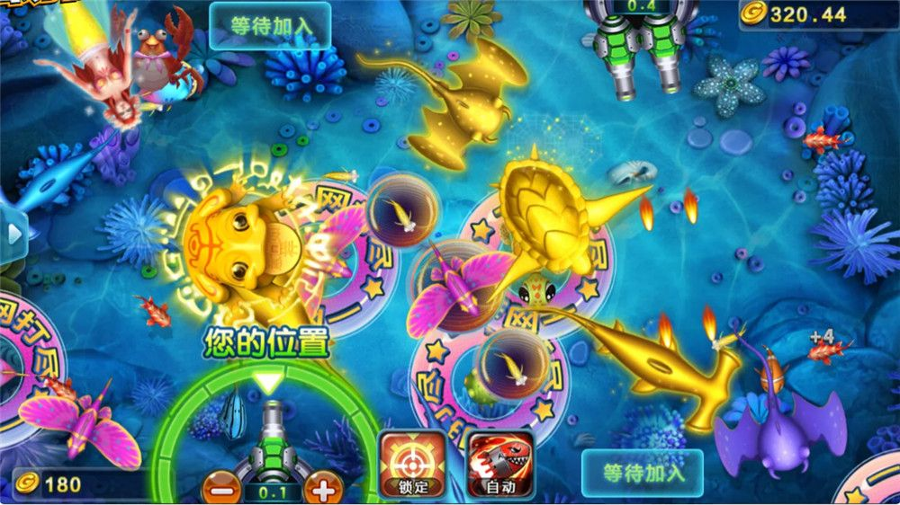

# 微星系列七七娱乐棋牌源码 7个UI

七七娱乐是微星系列的游戏项目，原介绍将其描述为经过较大幅度二次开发的平台，并提到“万国娱乐”。本文围绕大厅布局、多套界面资源和前端配置组织展开。

标题中的“7个UI”来自原介绍所称的“前端7套”。现有资料包含多种大厅样式，但尚未核对七套完整工程，也不能把同一大厅的不同分页直接算作不同 UI。

## 大厅布局

大厅采用横屏设计，主要有紫金配色、黑金配色和人物场景三种可辨识的视觉方向。游戏入口使用长卡片、双排方形卡片或主卡片搭配小卡片的方式排列。

| 布局 | 界面特点 | 前端组织要点 |
| --- | --- | --- |
| 长卡片 | 纵向插画占比较大，标题放在卡片下方 | 保持卡片比例，区分展示顺序与资源文件 |
| 双排网格 | 图标尺寸接近，入口集中排列 | 统一间距、文字基线和点击区域 |
| 主次卡片 | 一个较大的主题入口配合多个小入口 | 为不同尺寸卡片分别配置布局 |
| 人物场景 | 人物插画、背景和游戏入口共同组成大厅 | 避免背景遮挡按钮，检查小屏文字可读性 |

这些差异可以作为多主题界面设计的参考，但不能据此断言原项目支持运行时一键换肤、热更新或跨平台发布。

## 大厅局部展示

以下七张为大厅不同样式或分页的局部截图，不等同于已核实的七套独立 UI 工程。按原图裁去顶部账号、金额栏及底部购币、充值、代理推广栏，保留中央布局；未重绘游戏图案或更改游戏名称。裁剪仅用于版面展示，不代表原软件已移除相关功能。

### 紫金长卡片布局



### 紫金大厅另一分页



### 黑金双排图标布局



### 人物主题大厅



### 黑金双排卡片布局



### 黑金方形图标布局



### 黑金长卡片布局



## 玩法资料

资料涉及台湾麻将、斗地主、牛牛和千炮捕鱼。人物大厅还出现“2人十三支”和“推筒子”等名称；它们与原介绍中的名称分别保留，不擅自合并为同一种玩法。

目前没有完整玩法配置和运行记录，因此不列出已经验证的游戏总数，也不承诺全部入口对应可运行模块。

## 捕鱼场景

捕鱼界面以蓝色海底为背景，鱼群、特效与炮台构成主要画面。场景包含玩家位置提示、等待加入状态、锁定和自动操作入口，可用于研究角色层次、多人位置布局与按钮排布。



这张图保留了原界面的数值和图标，仅用于界面资料说明；不能据此判断数值是否对应现金，也不代表原程序已经完成非现金改造。

## 多主题配置示例

多套 UI 可以把颜色、间距与卡片布局放入独立配置，让界面渲染代码读取配置。下面是为本文编写的独立 JavaScript 教学示例，只有三种演示主题，不是原项目源码，也不是原项目七套 UI 的实际配置。

```javascript
const themes = new Map([
  ["violet", { background: "#241742", accent: "#F3CB65", columns: 4 }],
  ["dark", { background: "#171717", accent: "#D6B56A", columns: 5 }],
  ["ocean", { background: "#073A50", accent: "#77DDF2", columns: 4 }]
]);

function createLobbyView(themeId, gameNames) {
  if (!Array.isArray(gameNames) ||
      gameNames.some(name => typeof name !== "string" || !name.trim())) {
    throw new TypeError("gameNames 必须是非空名称组成的数组");
  }
  const theme = themes.get(themeId) ?? themes.get("violet");
  return {
    theme: { ...theme },
    cards: gameNames.map((name, index) => ({
      name: name.trim(),
      row: Math.floor(index / theme.columns),
      column: index % theme.columns
    }))
  };
}

console.log(createLobbyView("dark", ["台湾麻将", "斗地主", "千炮捕鱼"]));
```

返回值只包含样式配置和卡片位置，不创建游戏逻辑。接入界面时，由渲染层将这些数据转换为节点或组件；加载图片、适配屏幕和处理点击事件需要另外实现。

## 工程核对

确认七套 UI 时，应逐套核对大厅场景、公共按钮、游戏图标、字体和资源引用，记录它们是独立工程、主题目录还是同一大厅的不同页面。

还需要核对编辑器版本、客户端与服务端边界、依赖和构建方式。本次没有提供可检查的源码目录或工程配置，不能沿用其他项目的 Cocos、C++、ASP.NET 或数据库信息。

## 使用范围

本文用于界面设计与非现金娱乐软件开发学习，不提供现金下注、兑现、代理招募、收益承诺或操控输赢的说明。原资料中的购币、充值、代理推广及投注画面未用于正文展示；省略这些画面不意味着原程序不存在相应功能。

完整工程尚未完成编译、运行或安全审计，原始图片和代码资料的公开使用也需要具备相应授权。

## 交流反馈

文档勘误与开发学习交流：Telegram [@root4433](https://t.me/root4433)。

仅供学习与非现金娱乐，禁止用于赌博。

